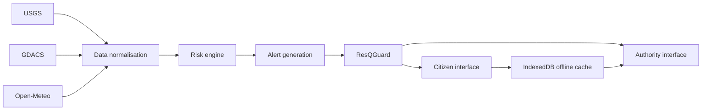

# ResQMap AI — From Early Warning to Trusted Action

ResQMap AI is an IGAD Hackathon 2026 prototype for turning hazard intelligence into clear, multilingual, safety-checked action for East African communities.

Public website: https://resqmap-live-site.vercel.app

## Project Overview

Problem: hazard data often exists before a disaster becomes dangerous, but communities may still receive late, unclear or incorrectly translated instructions.

Solution: ResQMap connects hazard feeds, normalises events, labels confidence clearly and runs every citizen-facing instruction through ResQGuard before delivery.

Target users:

- Citizens who need immediate, local, understandable instructions.
- Emergency authorities who need reports, source evidence and escalation workflows.
- Humanitarian teams who need a shared operating picture for early action.

Main value: ResQMap does not stop at detecting risk. It helps convert early warning into trusted action.

## System Architecture



USGS, GDACS and Open-Meteo feed the data-normalisation layer. The risk engine classifies hazards and alert text. ResQGuard validates severity, numbers, units, location and safety actions before the citizen and authority interfaces display the result.

## Implemented Features

- Live hazard intelligence for IGAD and East African communities.
- Globally extensible map architecture with search and geolocation.
- Connected source status for USGS earthquakes, GDACS alerts and a weather-risk model.
- Clear data labels: `LIVE`, `MODEL-DERIVED`, `SIMULATED` and `COMMUNITY-REPORTED`.
- Citizen alert view with English, Kiswahili and Somali guidance plus browser voice playback.
- ResQGuard translation validation that blocks dangerous changes before delivery.
- Community report and authority verification flow.
- IndexedDB offline prototype for the last verified warning and queued reports.
- Automatic five-minute refresh plus manual retry.
- Browser voice playback for citizen alerts.

## Live Versus Prototype Features

| Feature | Label | Status |
| --- | --- | --- |
| USGS earthquake feed | `LIVE` | Connected external feed |
| GDACS disaster feed | `LIVE` | Connected external feed when available |
| Open-Meteo drought/rainfall signals | `MODEL-DERIVED` | Connected model input |
| Lower Shabelle emergency journey | `SIMULATED` | Representative judge scenario |
| Citizen incident report | `COMMUNITY-REPORTED` | Browser-session prototype workflow |
| Authority verification dashboard | `COMMUNITY-REPORTED` | Prototype authority workflow |
| Offline queue | Prototype offline storage | IndexedDB demonstration, not a production sync backend |

## Data Sources

| Source | Status in prototype | Classification | Use |
| --- | --- | --- | --- |
| USGS Earthquakes | Connected | LIVE | Recent earthquake events |
| GDACS Alerts | Connected | LIVE | Flood and drought alert feed |
| Open-Meteo | Connected | MODEL-DERIVED | Soil-moisture and rainfall risk signals |
| ResQMap scenario data | Local | SIMULATED | Lower Shabelle judge demonstration and shelter data |

External API calls use request timeouts so one slow feed does not freeze the full hazard response. The client also refreshes source data automatically every five minutes and supports manual retry.

## ResQGuard Evaluation

ResQGuard checks that translated or edited emergency messages preserve:

- Severity: critical/red, severe/high/orange, moderate/yellow and low/green mappings.
- Numbers: numeric safety distances and other measurements.
- Units: metres, kilometres, feet and other measurement units.
- Location: place names and multilingual location aliases.
- Hazard type: flood, drought and earthquake meanings.
- Safety action: required instructions such as not crossing moving water.
- Dangerous wording: unsafe advice such as entering floodwater or ignoring warnings.

The executable evaluation fixture contains 72 manually reviewed alert cases:

- 24 safe messages
- 48 unsafe mutations
- 3 languages: English, Kiswahili and Somali
- 8 unsafe categories: changed numbers, changed units, missing instructions, wrong severity, wrong location, dangerous wording, incomplete translation and wrong hazard
- Expected result recorded for every case

Current measured result from `node --test tests/resqguard-evaluation.test.mjs`:

- Unsafe messages detected: 48/48
- Safe messages approved: 22/24
- Number and unit decisions correct: 69/72
- Severity decisions correct: 72/72

The CSV fixture is available at `public/resqguard-evaluation-cases.csv`.

## Testing Evidence

Evidence files are stored in `submission/`:

- Hazard map screenshot: `submission/screenshots/01-live-map-hazard-evidence.jpeg`
- Citizen alert screenshot: `submission/screenshots/02-citizen-multilingual-alert.jpeg`
- Blocked translation screenshot: `submission/screenshots/03-resqguard-message-blocked.jpeg`
- Authority dashboard screenshot: `submission/screenshots/04-authority-verified-escalated.jpeg`
- Evaluation results screenshot: `submission/screenshots/05-genuine-evaluation-results.jpeg`
- Workflow test report: `submission/WORKFLOW_TEST_REPORT.md`

## Technology Stack

- Next.js
- React
- TypeScript
- Leaflet
- IndexedDB
- Vercel
- USGS earthquake feed
- GDACS disaster feed
- Open-Meteo weather and soil-moisture data

## Prototype Limitations

This is not a certified government warning system. The Lower Shabelle flood card is intentionally labelled as a simulated scenario. The community report and authority dashboard demonstrate the verification journey inside one browser session; they are not a production multi-user backend. Offline behavior stores one verified warning and queued report records in browser IndexedDB for prototype evidence.

Next steps:

- Integrate official government alert approval and CAP feeds.
- Add telecom delivery through SMS, cell broadcast and zero-rated access.
- Connect humanitarian field-report systems and verified shelter registries.
- Replace prototype authority/session state with a production incident database and authenticated roles.

## Deployment Links

- Live website: https://resqmap-live-site.vercel.app
- GitHub repository: https://github.com/YashKatiyar0008/resqmap-ai
- Demo video: record from the production website using `submission/FIVE_MINUTE_DEMO.md`

## Do Not Upload

- The screenshot itself as the only deliverable.
- A large `node_modules/` folder.
- The entire uncompressed local source folder.
- An APK, because ResQMap is currently a web platform.
- API keys or environment files.
- A video that exceeds the 35 MB limit.

## Run Locally

```bash
npm install
npm run dev
```

## Verify

```bash
node --test tests/resqguard-evaluation.test.mjs
npm run vercel-build
```

## Submission Package

Supporting judge materials are in `submission/`:

- `FIVE_MINUTE_DEMO.md`
- `ARCHITECTURE_AND_DATA.md`
- `RESQGUARD_METHODOLOGY.md`
- `WORKFLOW_TEST_REPORT.md`
- `SCREENSHOT_CHECKLIST.md`
- `SUBMISSION_PACKAGE.md`
