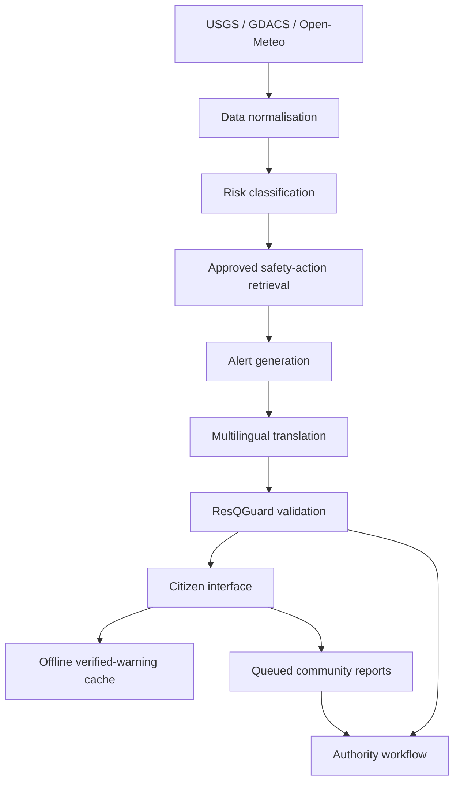

# Architecture and data flow

## Implementation

- Frontend: Next.js and React
- Backend: Next.js server routes
- Map: Leaflet with OpenStreetMap/CARTO tiles
- Live APIs: USGS earthquake feed and GDACS disaster feed
- Model-derived data: Open-Meteo soil-moisture and rainfall signals
- Safety validation: deterministic number, severity, location, required-action and dangerous-wording checks
- Offline behavior: IndexedDB prototype cache for one verified warning and queued reports
- Hosting: Vercel and connected Sites deployment

## Data labels

- **LIVE:** reported by a connected external feed and refreshed by the source pipeline
- **MODEL-DERIVED:** calculated from forecast/model inputs
- **SIMULATED:** controlled demonstration data
- **COMMUNITY-REPORTED:** submitted through the citizen workflow and awaiting authority verification

## Source behavior

If a source fails, ResQMap keeps the last verified warning visible and identifies the source as cached instead of exposing a technical error to citizens. The frontend refreshes hazards every five minutes and also supports manual retry. The API uses request timeouts so a slow upstream feed degrades instead of freezing the full response.
