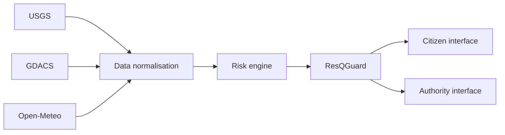

# ResQMap AI submission package

**Title:** ResQMap AI — From Early Warning to Trusted Action

**Positioning:** ResQMap is a multilingual early-warning-to-early-action platform that converts hazard intelligence into safe, locally understandable and verifiable action.

## Deliverables

- Public website: https://resqmap-live-site.vercel.app
- Connected deployment: https://resqmap-east-africa.yashkatiyar226.chatgpt.site
- Public GitHub repository: https://github.com/YashKatiyar0008/resqmap-ai
- Demo video: record one continuous five-minute take from the public Vercel website; keep the final file under the 35 MB upload limit
- Five-minute narration and click script: `FIVE_MINUTE_DEMO.md`
- Architecture and data-source explanation: `ARCHITECTURE_AND_DATA.md`
- ResQGuard methodology and genuine results: `RESQGUARD_METHODOLOGY.md`
- Reliability evidence: `WORKFLOW_TEST_REPORT.md`
- Five captured screenshots: `screenshots/` and `SCREENSHOT_CHECKLIST.md`

## Project overview

ResQMap AI addresses a specific early-warning gap: hazard data may exist, but citizens can still receive unclear, late or dangerously changed instructions. The solution connects live and model-derived risk signals, converts them into local action guidance, validates the message with ResQGuard and demonstrates how citizens and authorities can act from the same warning.

Primary users are citizens, emergency authorities and humanitarian responders across IGAD and East African communities.

## System architecture

USGS, GDACS and Open-Meteo feed the data-normalisation layer. Normalised hazards move through the risk engine, alert generation and ResQGuard validation before reaching citizen and authority interfaces.

## Implemented features

- Live hazard feeds from USGS and GDACS.
- Model-derived drought/rainfall signals from Open-Meteo.
- Interactive Leaflet map with search, geolocation, pan and zoom.
- Multilingual citizen alerts in English, Kiswahili and Somali.
- Browser voice playback.
- Automatic five-minute refresh and manual retry.
- IndexedDB storage for one verified offline warning and queued reports.
- ResQGuard validation for severity, numbers, units, location, hazard type, required safety actions and dangerous wording.

## Live versus prototype features

- **Live data:** USGS earthquakes and GDACS disaster alerts when the feed is reachable.
- **Model-derived data:** Open-Meteo rainfall and soil-moisture signals.
- **Simulated emergency scenario:** Lower Shabelle flood journey for the judge demonstration.
- **Prototype authority workflow:** Session-state verification and escalation dashboard.
- **Offline queue demonstration:** IndexedDB proof for cached warning and queued reports, not a production sync backend.

## Evaluation results

- 72 manually reviewed alert cases.
- 24 safe messages.
- 48 unsafe mutations.
- 3 languages: English, Kiswahili and Somali.
- 8 failure categories.
- Unsafe messages detected: 48/48.
- Safe messages approved: 22/24.
- Number and unit decisions correct: 69/72.
- Severity decisions correct: 72/72.
- Downloadable fixture: `public/resqguard-evaluation-cases.csv`.

## Testing evidence

- Hazard map screenshot: `screenshots/01-live-map-hazard-evidence.jpeg`
- Citizen alert screenshot: `screenshots/02-citizen-multilingual-alert.jpeg`
- Blocked translation screenshot: `screenshots/03-resqguard-message-blocked.jpeg`
- Authority dashboard screenshot: `screenshots/04-authority-verified-escalated.jpeg`
- Evaluation results screenshot: `screenshots/05-genuine-evaluation-results.jpeg`

## Technology stack

Next.js, React, TypeScript, Leaflet, IndexedDB, Vercel, USGS, GDACS and Open-Meteo.

## Demo readiness

- The complete workflow passed twice without a refresh.
- The frozen Vercel production build is the recording target.
- Five evidence screenshots were captured from production.
- No synthetic or stitched “demo recording” is included. The final video should be a genuine continuous screen recording with the presenter’s microphone, following `FIVE_MINUTE_DEMO.md`.

## Prototype limitations

- Not a certified government emergency-warning system.
- GDACS and USGS availability depends on external services.
- Drought indicators are model-derived, not field measurements.
- Safe points are demonstration records requiring official verification.
- Proximity is straight-line distance, not an evacuation route.
- Community reports are session-based prototype data, not yet stored in a production incident database.
- ResQGuard is a rules-based prototype with documented misses; it is not a substitute for official review.

## Future integration plan

### Governments

Integrate national emergency-operation centres, official CAP alert feeds, authenticated officer approvals, verified shelter registries and audit-retained incident records.

### Telecom providers

Deliver approved messages through cell broadcast, SMS and zero-rated citizen access while retaining ResQGuard checks before transmission.

### Humanitarian organisations

Connect verified field reports, multilingual message libraries, humanitarian data exchange feeds and partner-managed safe-point verification.

## Do not upload

- The screenshot itself as the only deliverable.
- A large `node_modules/` folder.
- The entire uncompressed local source project.
- An APK, because ResQMap is currently a web platform.
- API keys or environment files.
- A video that exceeds the 35 MB limit.
